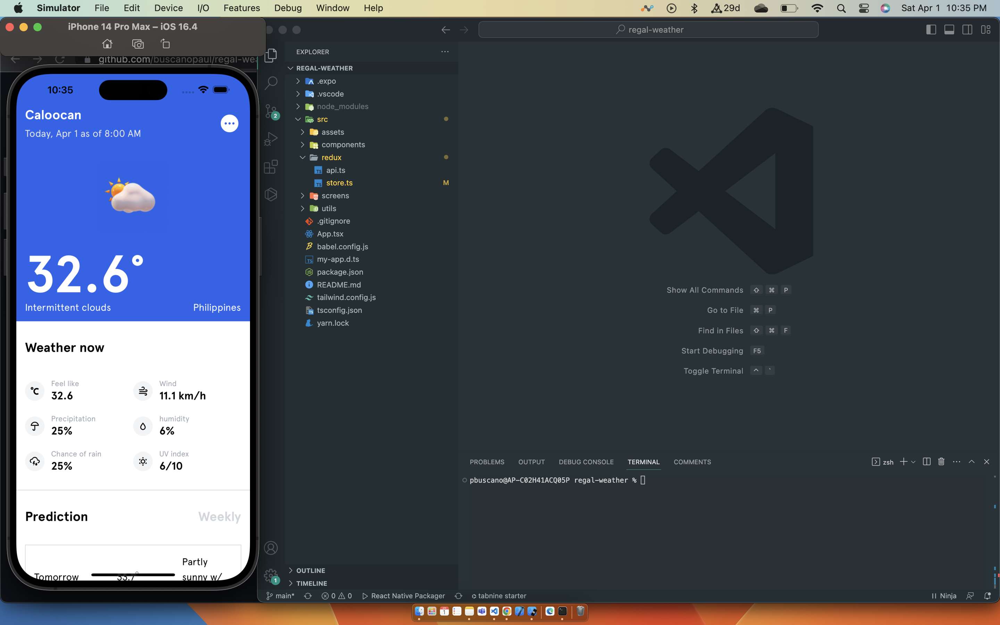

# TypeScript Example



install dependencies

```sh
yarn
```

To Run react native expo and run it with ios simulator

```sh
yarn start
```

Note: The app is getting your current location, you need to allow the app to share location

I didn't create a .env file you can directly change the api key in src/redux/api.ts

```sh
const ACCUWEATHER_API_KEY = apikey';
```

## Libraries installed

- expo-location for getting the current location
- redux toolkit query for state management
- tailwind css
